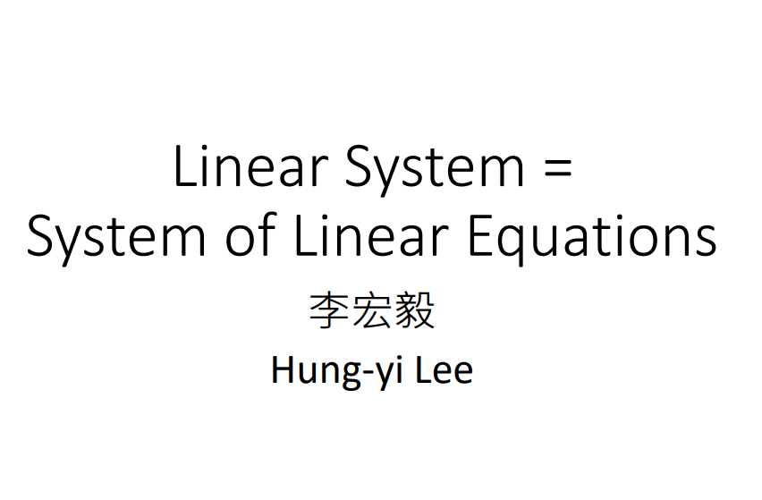

讲一个线性代数是什么，在线性代数学问里面，我们预期学到什么样的知识，预期它可以解决什么样的问题

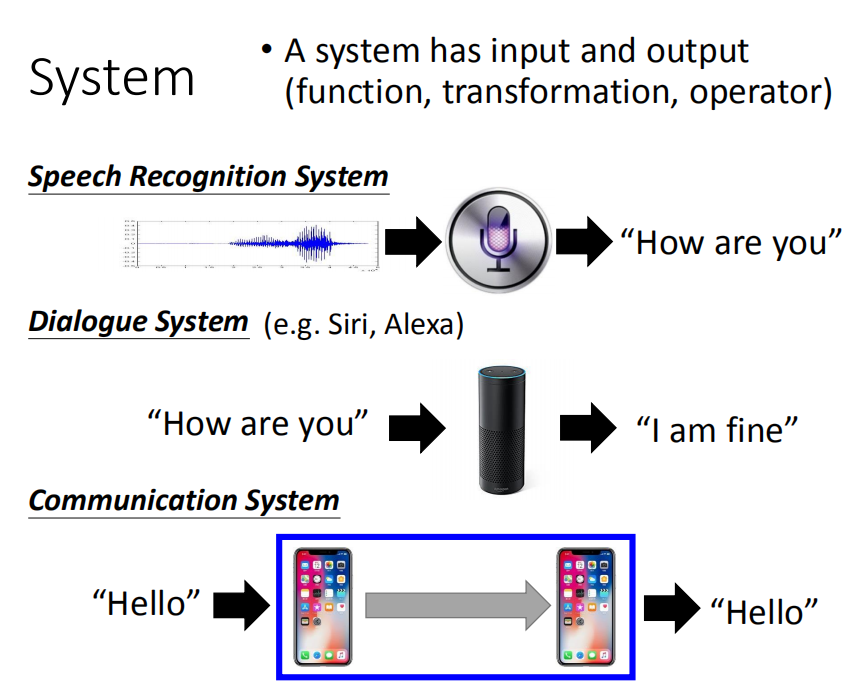

在这之前呢，我们要先提一个东西，这个东西叫做系统，叫做system，System这个东西其实在信号与系统里面你会更详细的学到相关的知识。

我们来稍微说下什么是系统，系统概念非常简单。你给它一个输入，它就会给你一个输出。你觉得用系统这个词觉得有点陌生的话，那你其实可以把系统又叫是一个function。如果讲function的话，你可能就觉得比较熟悉了。大家在高中的时候一定都学过函数(一定都学过function)，它就是输入一个input，输出一个output。那随着情景的不同，Syetem有时候把它叫做transformation，有时候叫做operator，那指的都是一样的东西。

举例来说：语音辨识系统，它的输入是一段声音信号，而它的输出是这段声音信号的文字，我想大家这个都不陌生。在手机上，都有语音辨识的功能。

或者是对话系统(Siri, Alexa)，对话系统做的事情是什么呢？它的输入是一句话，输出是系统的回应(Siri说："How are you"，Alexa就会说："I am fine")

通讯系统指的是什么呢？如果今天你用手机跟你朋友聊天，你对着你的手机说：“Hello”，手机会把这个讯号传到基地台，然后在通过基地台，这个讯号会传到你朋友的手机那端，中间会有很冗长的process，直接用一个长箭头来表示。你在你手机那端说一个“Hello”，你朋友会听到“Hello”。那你可以把这整个讯号传输的过程(把你的“Hello”送过朋友手机那端)的当做是一个系统。这个系统的输入就是你说的话，系统的输出就是手机那端听到的声音。

##  线性系统的特征

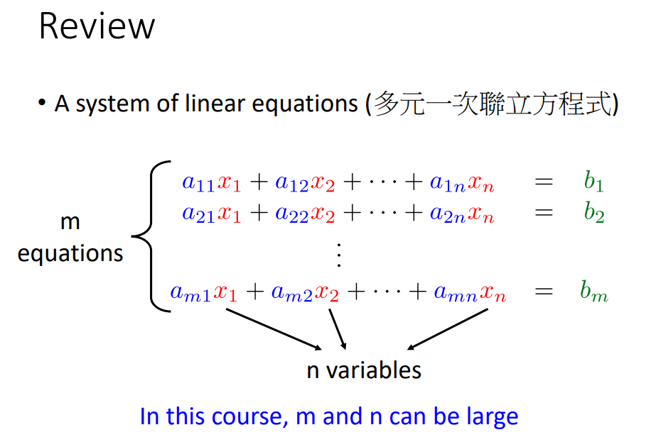

在线性代数这门课里面我们要学的是什么呢？其实在线性代数这门课里面，我们要讨论的就是线性的系统，我们会对线性的系统做各式各样的了解和分析。

那什么是线性的系统呢？我们刚才已经讲了什么是系统(有一个输入，有一个输出)。线性的系统它的输入和输出之间有某些特定的关系，输入和输出应该要有下面这两个特征。

第一特征是Presevering Multiplication。假设现在有一个线性系统，输入是一个x，输出是一个y。你现在简单的将x想成是一个数值(number)，y是另外的一个数值。有一个系统，输入是一个x，输出是一个y，如果它是一个线性系统的话，输入和输出之间要有这样的一个关系(如果把输出乘以k倍，输出也应该被乘以k倍)，这是线性系统的第一个特征。

第二个特征使Persevering Addition，假设现在线性系统的输入是$x_1$，输出是$y_1$，输入是$x_2$，输出是$y_2$。那如果我们输入$x_1+x_2$，那它的输出是$y_1+y_2$

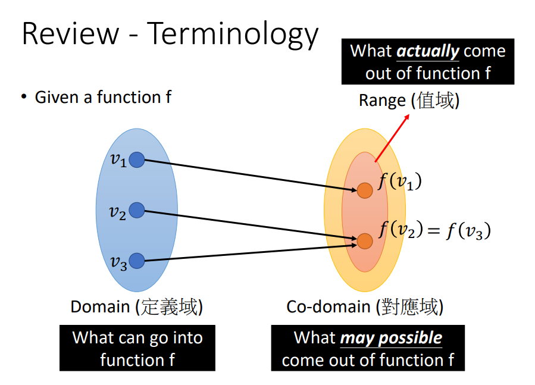

并不是所有的系统都是线性的，如果这个系统不是的线性的话，就不在我们这门课的讨论范围之内。

举例来说：这个系统的输入是x，输出是$x^2$，那现在让我们确定下是否满足这两个线性系统的特征。

这个系统输入x，输出是$x^2$，当这个系统输入kx的时候，线性系统输出的是$kx^2$，但是按照这个系统本身的特性，它输出会是$k^2x^2$，所以这不是一个线性的系统

线性系统的第二个特征，它也没有满足。输入$x_1$，输出$x_1^2$，输入$x_2$，输出$x_2^2$。如果是一个线性的系统，你输入$x_1+x_2$，这时候会输出$x_1^2+x_2^2$。但是你这个系统你输入$x_1+x_2$，而输出是$(x_1+x_2)^2$，$(x_1+x_2)^2$并不等于$x_1^2+x_2^2$。

所以这个系统不是一个线性的系统，因为它并不满足刚才讲的线性系统的两个特征，如果是这样的系统，就不在我们这门课的讨论范围之内。

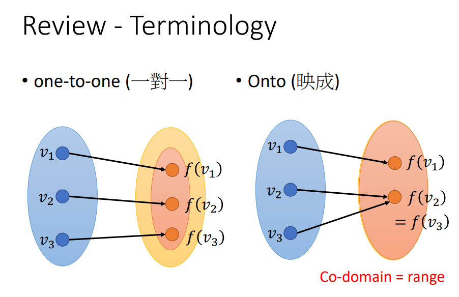

我们在举一个例子来说明：线性系统看起来是一个什么样子。我们刚才举的例子里面，线性系统就是输入一个x，它的输出就是一个y。

事实上这个系统可以输入更复杂的东西，之后会讲到说：输入甚至可以是一段连续的信号。如果要语音辨识系统的话，它输入是一段讯号，不仅仅是一个数值而已。

我们在举一个复杂的例子来说明线性系统是什么样子，现在假设我们有一个系统，输入是有两个数值($x_1,x_2$)，输出也是两个数值(第一个输出是将两个输入相加起来，第二个输出是将两个输入相减)。这个系统有两个输入，两个输出。接下来的问题是：它是不是一个线性的系统，我们要check一下是否满足我们定义的线性系统的两个properties

第一个properties：输入$x_1,x_2$，输出$x_1+x_2,x_1-x_2$。将输入乘以k倍(输入$kx_1,k_2$)，输入会变为$kx_1+kx_2,kx_1-kx_2$。输入乘以k倍，输出也会乘以k倍。所以说，线性系统的第一个特征是满足的。

线性系统的第二个特征，如果你输入$x_1,x_2$，输出$x_1+x_2,x_1-x_2$，输入$x_1',x_2'$,输出$x_1'+x_2',x_1'-x_2'$。那如果我们今天把输入加起来，输入$x_1+x_1',x_2+x_2'$，输出$(x_1+x_1')+(x_2+x_2'),(x_1+x_1')-(x_2+x_2')$

## 应用

### 电路学

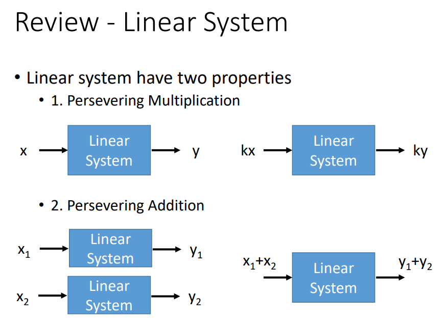

既然我们都已经讲了线性的系统，它有怎么样的应用呢。听起来好像是一件简单的东西，它可以被用在什么样的地方呢？第一个举得例子是在电路学这门课里面，所有的系统通通都是线性的系统。电路学这门课其实就是做了一件事，给你一个电路，这个电路上有一个输入，这个输入可能是一个电压源也可能是电流源(告诉你电压源有多少伏特，电流源有多少安培)。然后让你计算它的输出是多少(某个负载，某个支路的电压是多少)

其实整个电路就是一个系统，电压，电流源就是输入，负载上的电压和电流是输出。你可以check一下会发现说：整门电路里面我们的电路通通都是线性的，就算是有加电容，电感，事实上这样也是线性的。(电压源的电压乘以两倍，是否负载的电压和电流就会乘以两倍。你会发现这是符合线性系统的特征的)

### 信号与系统

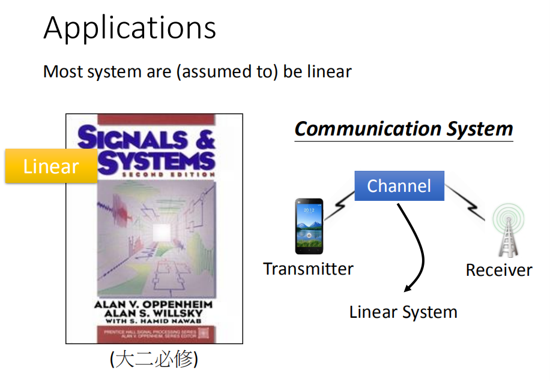

 第二个用用到线性代数的课是信号与系统，在信号与系统里面我们很多时候都会假设我们的系统是线性的。在信号与系统课中你会发现习题可能都会开头告诉你，我们现在现在讨论的是一个LTI(Linear Time Invariant System)的系统。
 
 
 所以你学了线性代数，你再去学信号与系统，你会信号与系统的原理，会有比较深度的体悟。
 
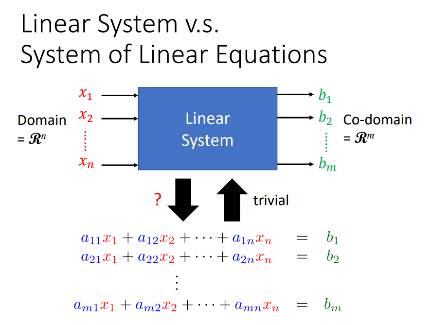
 
 
 线性代数会用在信号与系统的什么地方呢？在信号与系统里面你会学到Fourier Transorm(比较难)，Fourier Transorm在信号与系统里面会反复不断的出现。
 
 有一段信号(可能是声音讯号也有可能是其他的讯号)，你会做一个神奇的transform叫做Fourier Transorm，把它变为frequency domain。
 
 Fourier Transorm其实也是Linear System，输入讯号，输出讯号。其实这两个讯号是同一个讯号，你只是在不同的观点来描述这个讯号(一个同学，我可以叫你的名字，也可以叫你的学号)，不同的方式来称呼会有不同的好处。比如说：点名的时候，叫名字比叫学号更方便一点。time domain跟frequency domain对一个讯号来说，它就是同一个讯号的两个不同的名字。
 
 通常在信号与系统这门课里面，给你time domain要转成frequency domain，这个准换的过程其实是一个线性的转换。
 
 
 
 Fourier Transorm非常的复杂，很多同学觉得他不是线性的，很多人想到线性的时候，觉得画一条直线就是线性的。但是你仔细想一下，即便是很复杂的function，按照我们这门课刚才讲的线性系统的那两个特征，那仍然是一个线性的系统。Fourier Transor可以用我们在线性代数这门课里面所学到的种种概念来加以理解，
 

 
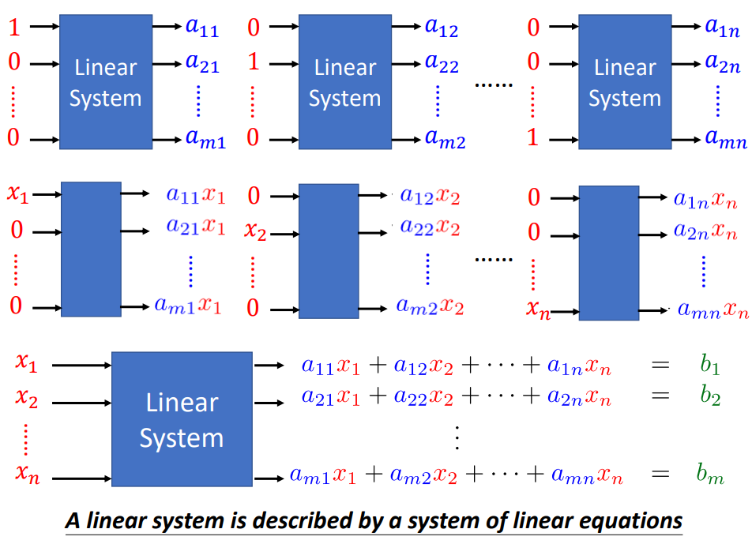
 
 用线性代数里面学到的东西，你可以做一个线性的系统，这个线性的系统可以做预测。在作业里面，有一个作业里面是：根据已经搜集到的资料，预测某一个观测站在下一个时间点PM2.5的数值
 
 ### 预测
 

 
 建一个可以做气象预报的系统，系统的输入是$x_1,x_2,x_3$，输出记作y。y这个数值是：某年某月某日某事PM2.5的值，这个值是我们希望这个气象预报系统可以预测出来的PM2.5数值。$x_k$指的是我们要预测这个时间的前k个小时观测站的PM2.5的数值。这是一个系统，进一步我为了计算方便，假设它是一个线性的系统。$x_1,x_2,x_3$和y之间的关系为：$y=w_1x_1+w_2x_2+w_3x_3$。
 
 你会发现这个系统符合刚才定义的线性系统的两个特性，如果知道$w_1,w_2,w_3$，你就可以把$x_1,x_2,x_3$输进去，它就可以输出y，你就可以做气象预报。
 
 
 你可能会有问题：用一个线性的系统，可以准确的预测PM2.5吗？过去的PM2.5跟未来PM2.5之间的关系感觉会用很多不同事件的影响，感觉之间的关系非常的复杂，也许它们之间并不是一个线性的关系。但是你会发现说：就算你假设它们之间的关系是线性的，其实误差也不会有太大的偏差。
 
第二个问题是：这个$w_1, w_2, w_3$是咋样来的呢？我们肿么知道这个系统里面的参数长什么样子呢？我们肿么知道输入和输出之间要有咋样的关系？我们只知道它们之间的关系是线性的，$w_1,w_2,w_3$的数值是多少，这个咋样找出来的呢？你可以主观的设置(1, 1, 1.5)，但这样的效果可能不会太好。实际上你要做的事情就是：让它自己学出来。这个就是“机器学习”的基本概念。
 
 
 ### Google的搜寻
 

 
 线性代数还有很多的应用，举一个在日常生活中都会用到线性代数的应用——Google的搜寻。在Google搜寻的时候，你输入一个关键字，它会给你一排的搜寻的结果。这一排搜寻的结果，  假设你在这里的关键字是“台湾大学”，你搜寻出来的网页多数包含台湾大学。很多网页都有包含台湾大学，那应该咋样去排序呢？Google肿么知道把台湾大学首页排在整个搜寻列表的第一个呢？而不是排在最后一个。
 
 这个可能要用到PageRank的技术，也就是有一个方法来计算每个网页的中重要性，PageRank代表了网页本身的重要性。

 ### PageRank

 
 在这个示意图上面，每一个笑脸代表一个网页。笑脸和笑脸之间他们有箭头连接在一起，这些箭头指的是：网页和网页之间的超链接

PageRank所做的基本假设是：假设现在有一堆人，在网路上浏览网页。他们平常逛网路的习惯是：假设这个人现在在看蓝色这个网页，它看完以后，想要跳转到下一个网页，跳转到哪一个网页，取决于这个蓝色的网页有哪些超连接，若这个蓝色的网页有3个超连接，分别连到红、黄、绿三个网页。这代表这个人看完这个网页以后。假设有$\frac{1}{3}$的几率去看红色，$\frac{1}{3}$的几率去看黄色的，$\frac{1}{3}$的几率去看绿色的。

假设有一堆人在网路上胡乱浏览网页，你就可以计算：在t个时间点，假设某个网页上的分布是某个样子，那下一个时间点，人数的分布会是什么样子。第t个时间点跟t+1个时间的人数分布它们中间其实是一个线性的关系。

同一个概念其实不是只能用在网页浏览上，比如说预测车流量，预测人口的流动。把这个网页换做城市，在每一个城市里面，每一个人想要搬去其它城市。如果你本来在蓝色的城市，有一定的几率想去红色的，有一定的几率想去黄色的，有一定的几率想去绿色的。你可以用同样的概率来预测人口的变化

 
 假设有一堆人在网路上看来看去，然后根据PageRank的计算，可以计算出每一个网页平均的人数是多少。现在随机给一个分布，然后经过无穷远的时候以后。大家会到底集中在哪些网页上。(如果有一个网，被很多人link到，最后看这个网页的会特别多，或者某个网页被某个重要的网页到，那看它的人也会特别多。 )
 
### Computer Graphics
 
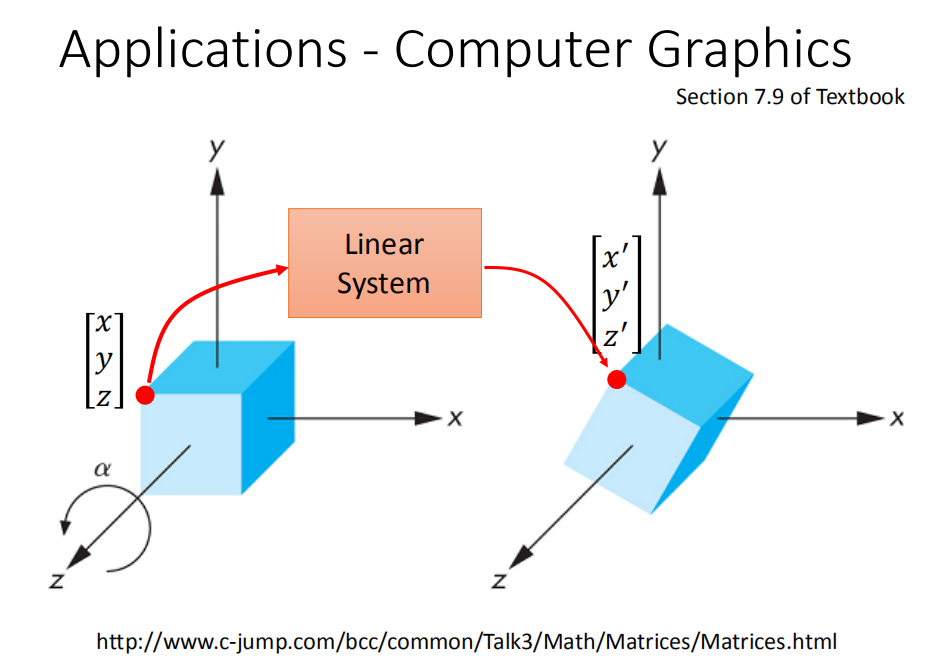
 
线性代数还可以用在Computer Graphics上面，在Computer Graphics里面有时候你想要把一个物件进行旋转。假设有一个方形，左上角点的坐标为$\begin{bmatrix}
x\\ 
y\\ 
z
\end{bmatrix}$，我们想要把这个物件进行旋转，旋转以后同一个点的坐标就会变为$\begin{bmatrix}
x'\\ 
y'\\ 
z'
\end{bmatrix}$
 
 
从 $\begin{bmatrix}
x\\ 
y\\ 
z
\end{bmatrix}$到$\begin{bmatrix}
x'\\ 
y'\\ 
z'
\end{bmatrix}$之间的关系你可以用一个线性系统来描述它。也就是说物件上的每一个点坐标跟转换后每一个点的坐标，它们之间的关系是线性的。你会发现线性代数会有非常非常多的应用
 
 
 ## 具体学习章节 
 ### 解释
  

 
在这门课里面，我们会针对线性系统做哪些了解和分析，在chapter1-3里面我们做的就是解释。给你一个线性的系统，然后给你线性系统的输出(比如说：3，6，9) ，接下来问你这个线性系统要输入咋样的数值它可以得到我们想要的输出。在chapter1，chapter2，chapter3我们就是在问这件事情。可能有好几个不同的可能是要讨论，第一个就是到底有没有solution，也就是这个红色问号到底填不填的进去某种数值让这个线性系统的输出就是我们给定的结果，还是说你找不到任何可能的输入得到我们想要的输出。
 
### 这个解是唯一的吗 
 
如果我们今天找得到某种输入可以得到想要的输出，接下来的问题就是这个解是唯一的吗？只有这一个输入可以得到我们想要的输出，还是其实有很多不同的输入都可以得到我们想要的输出。接下来第三个问题就是我们咋样找到这个解，既然我们确定有个解存在，那接下来我们会知道说：它可能是一个还是有多个，接下来是咋样找到这个解。另外我们会讲Determinants

其实在chapter1到chapter3里面，所讲的内容其实你在高中都学过，其实一个线性的系统就是一个多元一次的联立方程式。所以我们今天问你说：多元一次联立方程式到底有没有解，是不是唯一解，咋样来找它的解，其实你都会。只是在线性代数里面我们会用不同的观点来看待过去你已经都知道的事情。也就是说chapter1到chapter3里面的习题你完全可以会的，但是你用线性代数的观念来看的话，你会有不同的理解。

还有一个不一样就是高中只会讲3x3的行列式，但是在这门课里面会推广到nxn的行列式。通常你能够在高中里学到的线性系统，它的输入或输出是一堆数字，把这堆数字合起来叫做一个向量。其实向量这个概念你在高中就已经学过了，但是在这门课里面，我们会进一步的告诉你说其实线性系统的输入不一定是你所想象的那种向量，你所想象的那种向量就是一个点或者是二维(三维)空间中的一个箭头，这些都是在高中学过的东西。如果今天在这门课我告诉你说：vector并不仅局限于你想象的这个样子，举例来说一个function，一个讯号，一个会随着时间变化的讯号
，你也可以想象成一个vector。它不是你高中学过的vector，它才是真正的vector。它可以当做线性系统的输入，也可以是线性系统的输出，这是我们之后才会学到的。

所以很多的概念是你高中学到的，但是这门课里面还是会讲很多不一样的东西。

在第三章里面我只是给你一个指定的输出，要你找出什么样的输入可以得到这个输出。从第四章开始我们会讨论更加General的问题，其实线性系统输入其实是一个集合(各式各样的输入)，把集合中的每一个element都输入进去就得到了另外一个集合。在第四章里面，我要问的是咋样来描述这个集合，我们不是用集合这个词汇来描述输出所有的可能性的总和，我们会用另外一个词汇来描述它。在线性代数里面有另外一个词汇来描述线性系统所有输出的总和，那就会告诉大家维度的概念，维度这个概念其实也是学习过的。但是在线性代数这门课里面，你会清楚的认识到我们讲维度的时候到底举的是什么。

### 咋样来描述这个集合

另外一个要告诉大家的是，既然我们能够描述这个集合，描述的方法其实不止一种的，可以选择比较容易的方式来描述这个集合。选择比较容易的方式来描述这个集合的时候，线性系统就会改变，变成一个可能是比较简单的线性系统，那你来计算或者分析它就是变得比较方便。

在第七章我们会学到，假设我们指定的输出其实不在这个输出范围的集合里面，那线性系统就不可能得到这个输出。但是我们咋样在这个可能的集合里面，找到一个element，跟我们指定输出的距离是最近的

### Eigen value

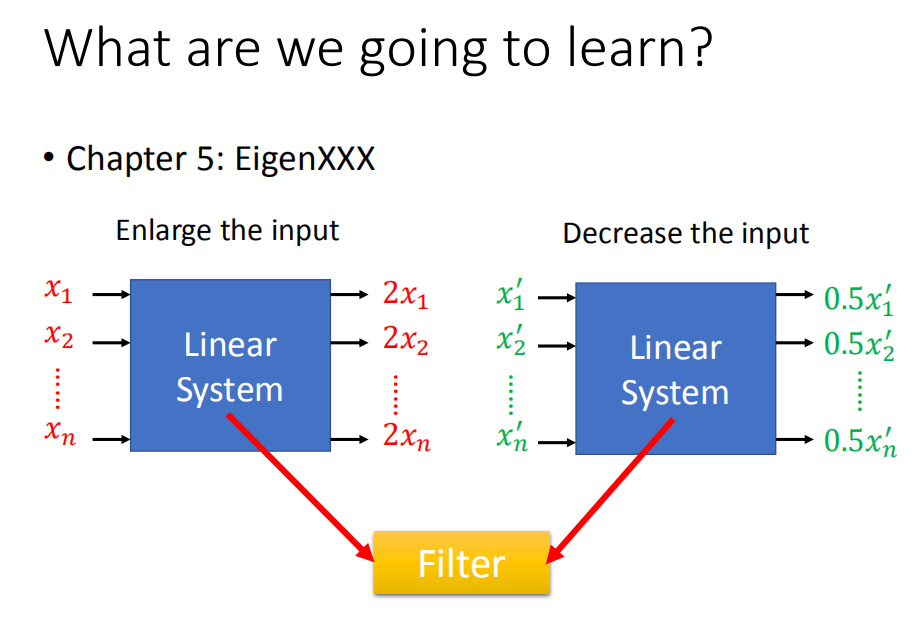

在第五章会讲一个Eigen value，有些linear System它会有些特别的输入，你输入$x_1,x_2,...,x_n$，它会直接给输入乘上2倍变大。或者是你输入另外一个向量，输出会把它变小。输出和输入的形状是一样的，但是它们的scale不一样。有了这些知识以后就可以做滤波器，滤波器要做的事情就是让某种类型的讯号过去，某种类型的讯号不能过去。你有一个第五章讲的概念以后，你就可以知道咋样设计一个滤波器，让某些讯号进来可以被放大，某些讯号进来可以被缩小。设计滤波器的种种原理，会在第五章里面提到基本的概念

今天这堂课的结论就是：线性代数是很重要的，在电机系如果没有把线性代数学好就好像没有学念能力却到了天空们技场两百楼。

