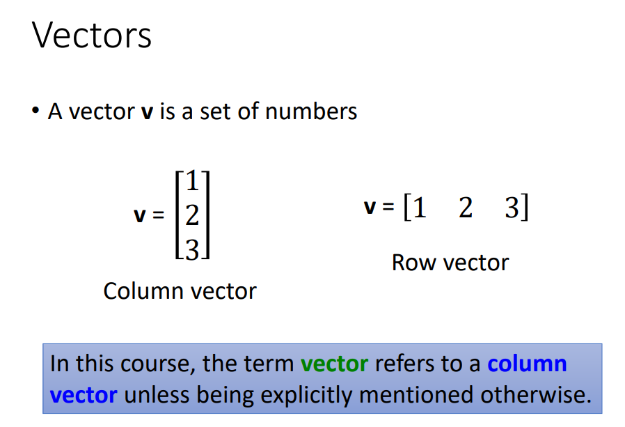
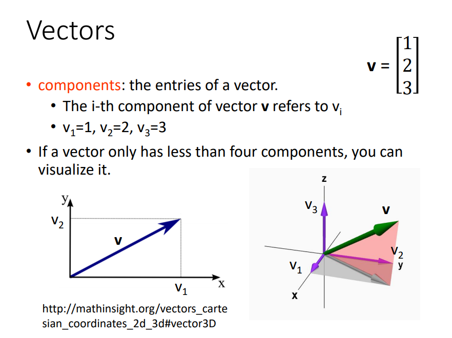
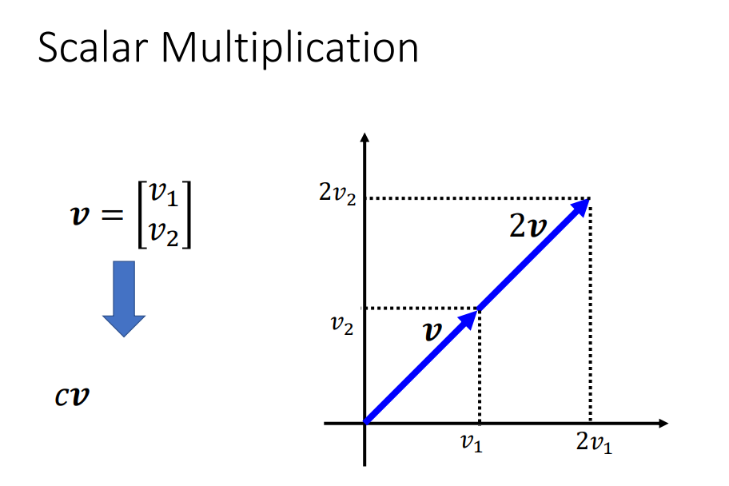
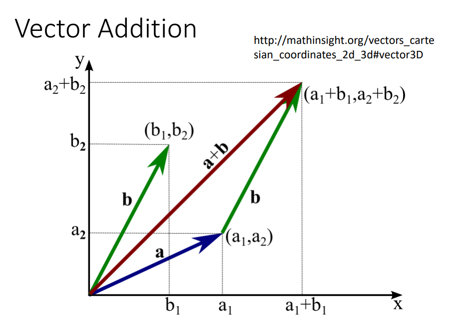
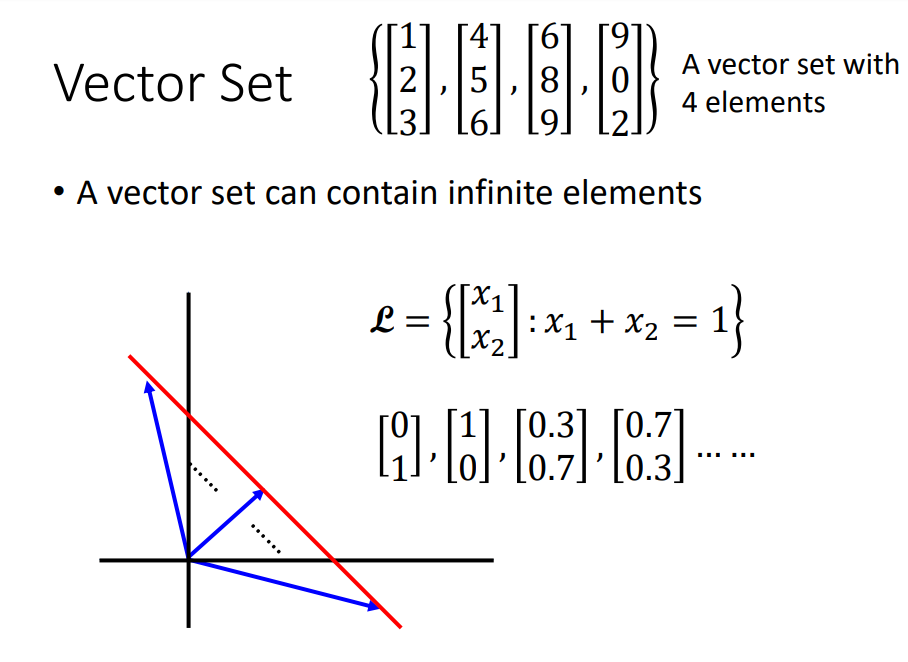
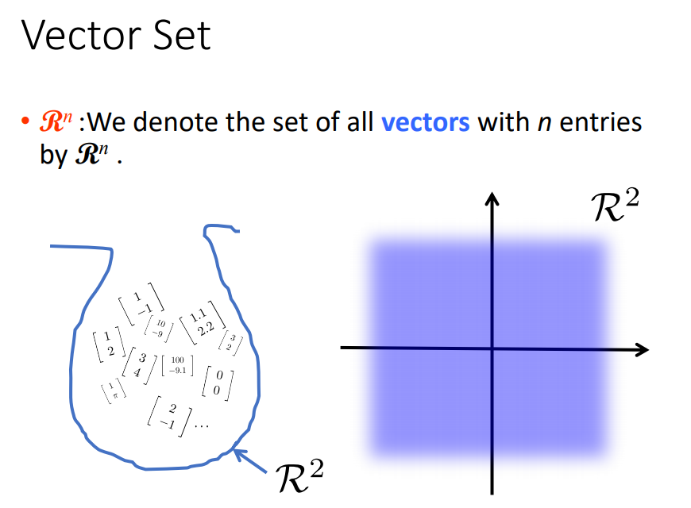
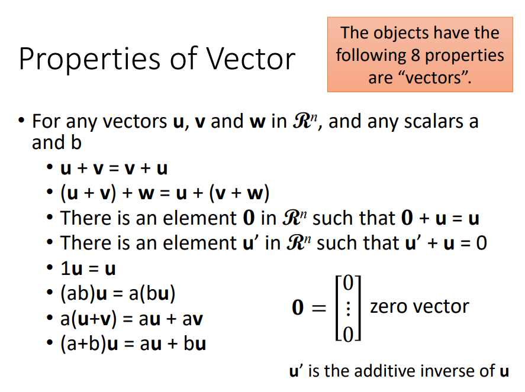
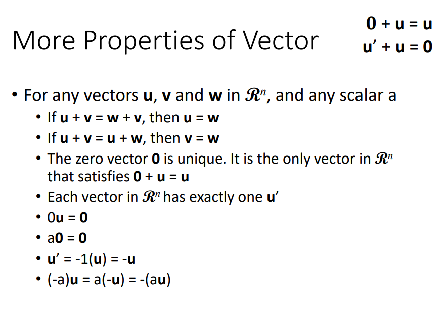

## 高中版本的向量

本节投影片要讲什么是向量，已经学过的高中版本向量，之后在第六章会告诉什么是真正的向量。

### 列向量

所谓的高中版本向量是：一组数字的集合用notation **v**来表示(粗体字表示向量)。举例来说：数字1,2,3集合起来，认为是向量。不一定是垂直方向(由上至下)，也可以是水平的(由左至右)，由上至下叫做column vector，由左往右叫做row vector，在这门课里面，我们通常提到的向量都是认为是column vector而不是row vector。

### 向量的组成

在向量里面有很多的components，如果今天要提到向量**v**里面第i个成员的时候，就会用$v_i$来表示。右边这个向量有三个成员(1,2,3)，第一个成员$v_1=1$，第二个成员$v_2=2$，第三个成员$v_3=3$。

如果一个向量的components小于4(小于四个数字组成)，可以在visualize(在二维空间里visualize二维的向量，可以在三维空间里visualize三维的向量)。通常得到做法是：一个向量里面有二个component，如果是在二维空间里面，将第一个component当做x坐标的值，第二个component当做y坐标的值，然后画一个箭头从原点指到($v_1,v_2$)的地方(两个component所决定点)。如果是三维也是一样(维度这个概念在第四章会详细的讲述什么是维度，我相信在高中会提到这个词汇，所以直接讲这是一个三维的向量，你也不会觉得困惑)，三维的向量有三个element，如果要将这个向量可视化，三个element分别代表x轴坐标，y轴的坐标，z轴的坐标。这三个坐标可以在三维空间中定义出一个点，然后可以画出一个箭头从原点指向($v_1,v_2,v_3$)所决定的点。

## 向量运算
### 标量相乘

向量**v**的component是$v_1,v_2$，将在向量**v**乘以数值c意思是：将向量里面的每一个component都乘以c。向量v第一个component$v_1$，第二个component$v_2$。如果你将这个向量v乘以2倍，就是将$v_1$乘以2倍，$v_2$乘以2倍，就得到了一个新的向量。2****v****可以想象是将原来的向量**v**在原来的方向上变成2倍。

### 向量相加

向量也是可以进行相加，如果你有向量a，两个component分别是$a_1,a_2$，向量b的两个component分别是$b_1,b_2$。向量a加向量b：就是将两个向量同一个维度的component分别加起来($a_1+b_1, a_2+b_2$)。你也可以很单纯的想象是将a这个向量拿出来，将b这个向量的尾部接在a向量的头部就可以得到向量$a+b$。

## 向量集合

将很多的向量集合在一起得到vector set(四个三维向量)，在这门课里面，当我们说到向量集合的时候，可以是有无穷多个成员。举例来说：我们有一个二维向量的集合，二维向量的component记为$x_1,x_2$，这个集合里面的成员($x_1,x_2$)都满足这个特性($x_1+x_2=1$)。$\begin{bmatrix}
0\\ 
1
\end{bmatrix}$`，`$\begin{bmatrix}
1\\ 
0
\end{bmatrix}$`,`$\begin{bmatrix}
0.3\\ 
0.7
\end{bmatrix}$`，`$\begin{bmatrix}
0.7\\ 
0.3
\end{bmatrix}$都是集合里面的成员。如果我们将这个集合画出来，如图所示其中红色这条线是$x_1+x_2=1$。高中学画向量时，就是从原点开始画一个箭头，所有有箭头的地方落在红色这条向量上就是这个集合里面的成员。箭头落在红色的向量其实有无穷多个，所以这个集合有无穷多个成员。

  

如果我们把所有n entries的向量通通集合起来，或者是将n维的向量集合起来，这个集合起来的向量被称为$R^n$(代表所以n维向量的集合)

如图这个vector通通属于$R^2$这个集合(二维向量)，$R^2$这个集合其实涵盖了整个二维的空间，二维空间中所有的点都是属于$R^2$这个集合的成员。 

## 向量的性质

向量有以下的特性，这些特性都是非常的truth feel，接下来也不会做任何的证明。假设现在有向量**u, v, w**是$R^n$的成员，也就是说**u, v, w**都是n维的向量，我们有任意三维的向量跟任意两个数值a, b。

**u+v**一定等于**v+u**，可以先将**u**跟**v**加起来，再加**w**等于将**v**跟**w**加起来，在加**u**。如果在$R^n$里面存在一个很特别的向量，用0来表示，这个特别的向量能力是：将0这个向量加上任何的向量u都会变回本身。这个特别的向量，每个element都是0，所以在这个向量加上任何一个向量都会是其他它量的本身。因为这个向量里面每一个成员都是0，所以称之为zero vector。

存在一个向量**u'**，这个**u'** 加上 **u**变为zero vector，对于每个**u**而言，可以找到对手**u'**，**u'** 叫做 additive inverse。

a跟b的scalar先相乘，在乘以**u**这个向量等于b先乘以向量**u**，再乘以a。

在这张投影片里面，想要告诉你向量有以下这些特性，但事实上真正的向量定义是反过来的，并不是说向量有这些特性，而是说有这些特性的东西就叫做向量。
 

