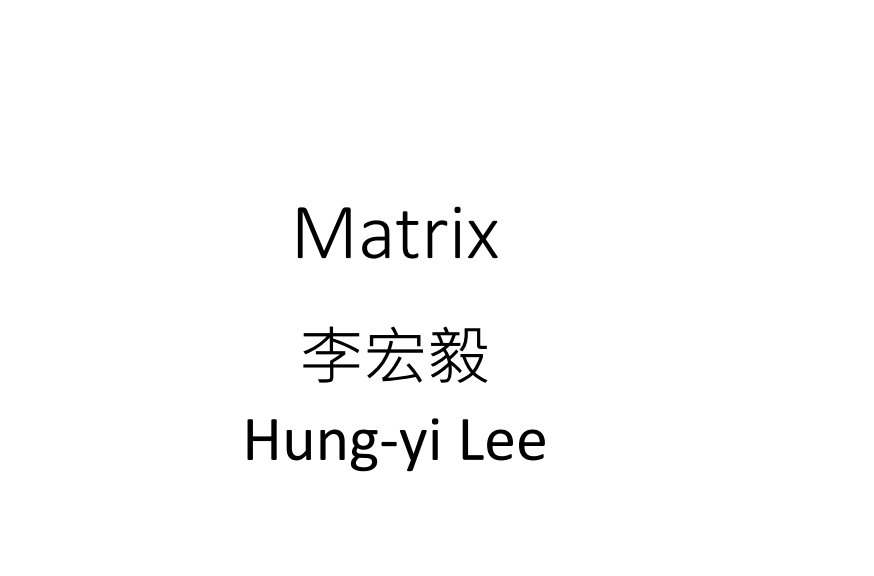
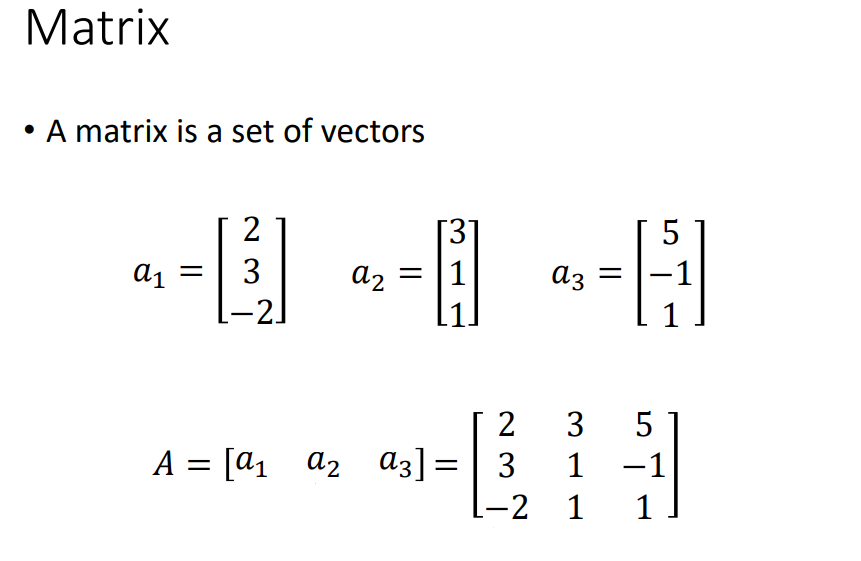
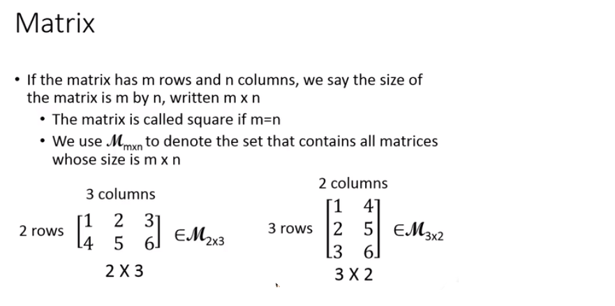
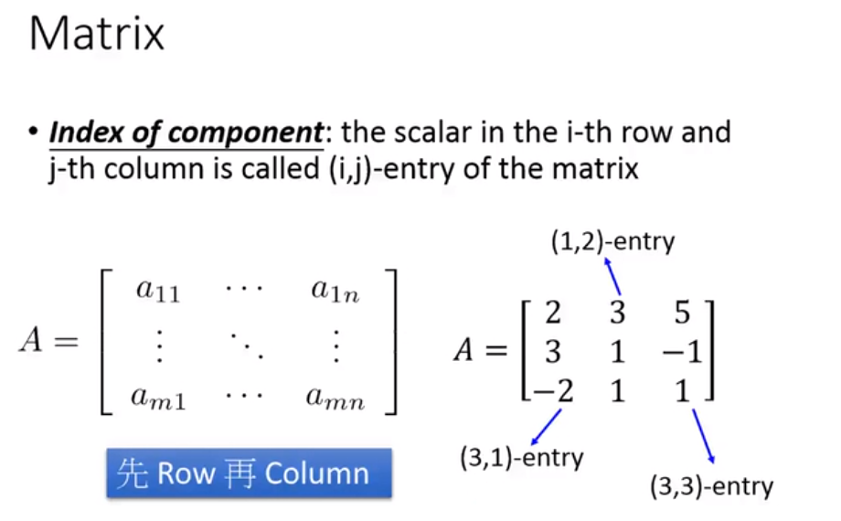
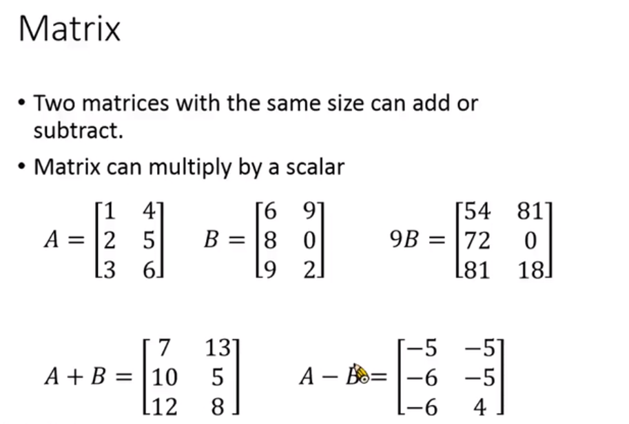
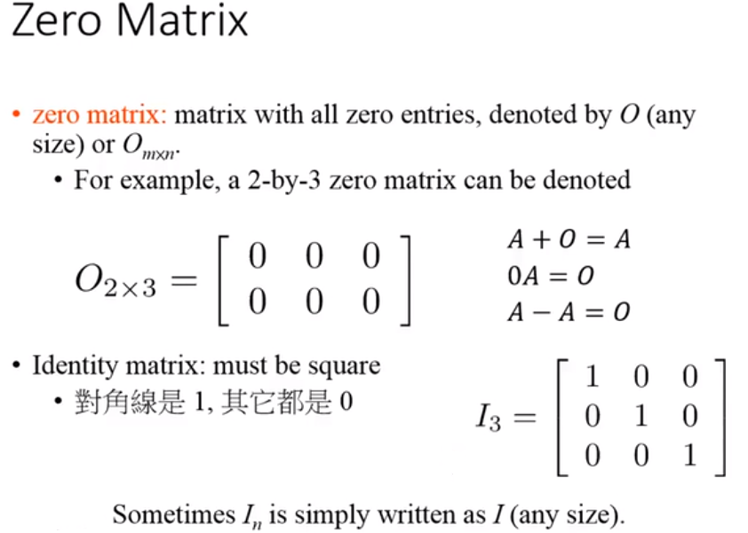
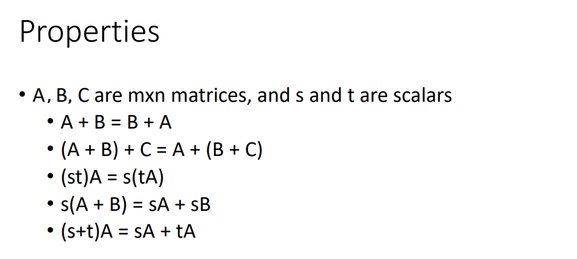
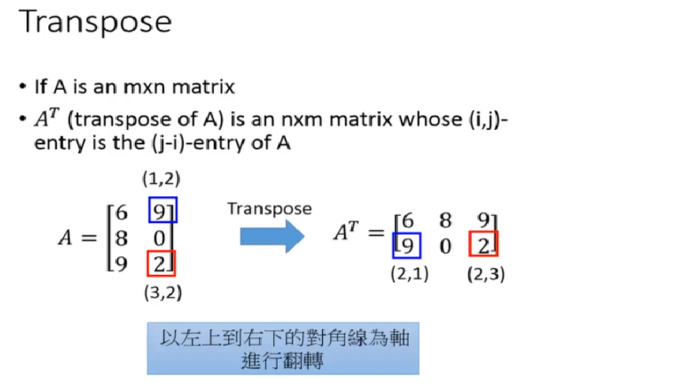

## 矩阵
### 矩阵的定义

有一组vector放在一起就变为matrix，假设现在有3个vector$a_1,a_2,a_3$，将3个vector排在一起。这三个vector就变成A这个matrix的三个columns。
 

$$A=[a_1,a_2,a_3]=\begin{bmatrix}
2 &3  &5 \\ 
3 & 1 & -1\\ 
 -2&  1& 1
\end{bmatrix}$$

### 矩阵的写法

接下来我们来定义下size的写法，如果一个matrix有m个rows n个columns，我们就说它的size是m x n。如果一个matrxi的m跟n是一样的就说它是square，我们会用**M**，下标m x n来代表所有m by n matrix所成的集合。

比如一个matrix有二个rows，3个columns，size描述为2 x 3($M_{2x3}$)。另外一个matrix有3个rows，2个columns，size描述为3 x 2($M_{3x2}$).

在matrix里面原则是：先row再column

如果今天要讲matrix第i个row，第j个column的成员时，那就用$(i,j)$来代表。假设有一个m by n 的matrix A(m个rows，n个columns)，在写每一个component下标的时候，原则是先写row index，在写column index。

有一个3 x 3的matrix，3是第一个row，第二个column，所以它的index是(1,2)。左下角-2是第三个row，第一个column，所以它的index是(3,1)

## 矩阵的运算

matrix有一模一样的size时，就可以将matrix相加或者相减，也可以给matrix乘以scalar。假设现在有两个matrix **A,B**，想给matrix B乘以9，就是将9乘以B的每一个component。A+B就是将同一位置的element相加，A-B就是将同一位置的element相减。

## 特殊矩阵

定义一些特别的matrix，Zero matrix就是每一个element都是O的matrix，就时候会有0来表示，可以是任何的size，也可以给O加上下标变为$O_{m\times n}$。$O_{2\times 3}$就是说：有一个matrix里面都是0，它的row是，column是3。任何的matrix加上Zero matrix都还是自己，任何的matrix乘以Zero matrix都还是Zero matrix，任何matrix减去自己本身的matrix是Zero matrix。

Identity matrix必须是正方形的，Identity matrix的特性是：左上到右下的对角线是1，其它部分都是0。我们通常会用大写I来表示Identity matrix，加上一个下标来代表size($I_3$代表是一个3 by 3的Identity matrix)。我们不需要用两个下标来表示它。

## 矩阵的性质

matrix有很多的特性，假设有A,B,C三个matrix，dimension都是m by n，s和t都是scalars

## 转置

 假设A是m by n的matrix，当给A加上一个上标T的意思是：$A^T$也是一个matrix，叫做transpose of A。A原来使是m by n的matrix，$A^T$是n by m的matrix。

假设有一个matrix A，然后给matrix A做transpose，做法是： 以左上到右下的对角线为轴进行翻转。原来在matrix A中的9在第一个row第二个column，做transpose时row跟column交换，变为第二个row第一个column。原来matrix A中的2是第三个row第二个column，做transpose以后就是第二个row第三个column。

假设A跟B都是m by n的matrices，s是一个scalar。如果我把matrix A做一次transpose，然后把A的transpose再做一次transpose之后还是matrix A($(A^T)^T=A$)，s乘以A再做transpose等于s乘以A的transpose($(sA)^T=sA^T$。A+B的transpose等于A的transpose加上B的transpose($(A+B)^T=A^T+B^T$)。

