## 矩阵和向量乘积
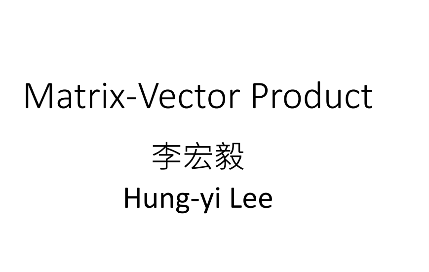

在高中是定义过matrix跟vector相乘，这节课将会再讲一遍，看看这节课的内容跟你高中学的有什么样的不同。

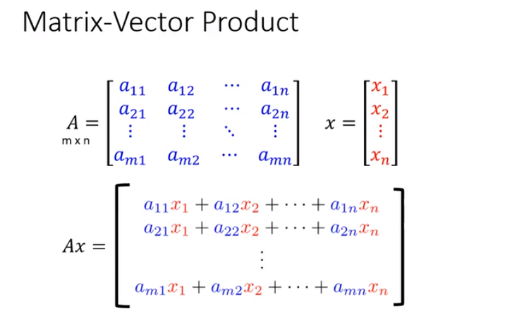

matrix A的dimension是m by n(m个rows，n个columns)，vector x有n个component。我们在高中都学过matrix A乘以vector x，x的dimension一定要是n by 1，如果是其它dimension的话就不match。

matrix A乘以vector x的定义是：把x第一个element($x_1$)乘以$a_{11}$加上第二个element($x_2$)乘以($a_{12}$)，一直到第n个element乘以($a_{1n}$)相加所得的结果放在第一位。x第一个element($x_1$)乘以$a_{21}$加上第二个element($x_2$)乘以($a_{22}$)，一直到第n个element乘以($a_{2n}$)相加所得的结果放在第二位，以此类推。

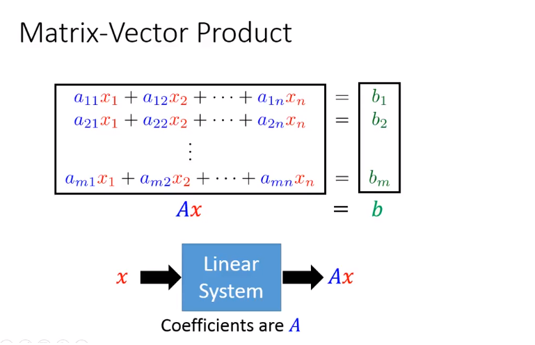

上述的这个式子其实就是多元一次联立方程式，所以多元一次联立方程我们把它未知数的部分($x_1,x_2,...x_n$)排成一个vector，把它的coefficients($a_{11},a_{12},...,a_{mn}$)排成matrix。多元联立方程式的左边其实就是一个vector x跟matrix A的相乘，右边的$b_1,b_2,...,b_m$可以看做是vector b。所以一次多元联立方程式可以用矩阵跟向量的乘积来描述($Ax=b$)。

如果我们用线性系统来解释时，所谓Ax是：线性系统的coefficients描述线性系统的参数(m by n element)，当把一个输入**x**($x_1,x_2,...x_n$)丢进线性系统里面时，输出就是Ax。

matrix A跟vector x相乘这件事有两个不同的看法。

### 行的角度

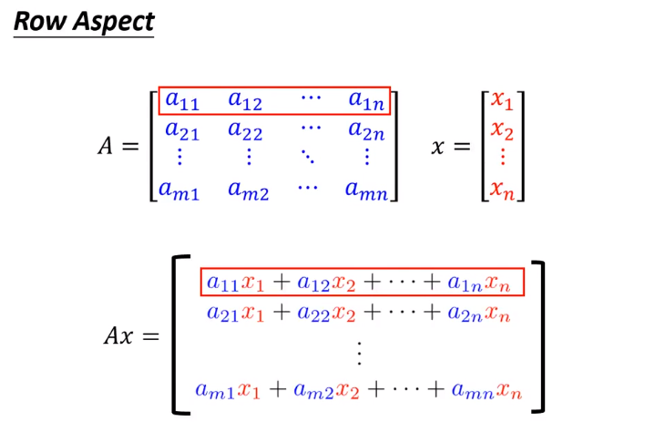

第一个是row aspect，Ax表示把vector x 对A的每一个row做内积得到scalar($a_{11}x_1+a_{12}x_2+...+a_{1n}x_n$)，这个scalar是Ax的第一个component。

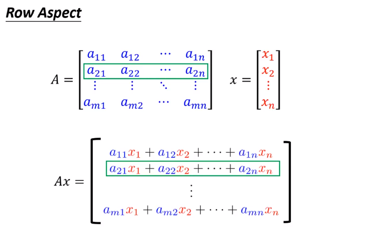

得到scalar是Ax的第二个component

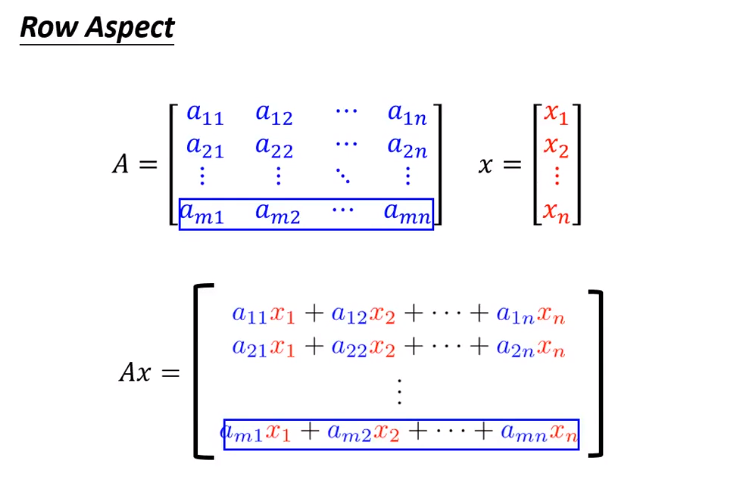

得到scalar是Ax最后一个component

可以用vector跟row做inner product这样的方式来理解vector跟matrix的相乘。

### 列的角度

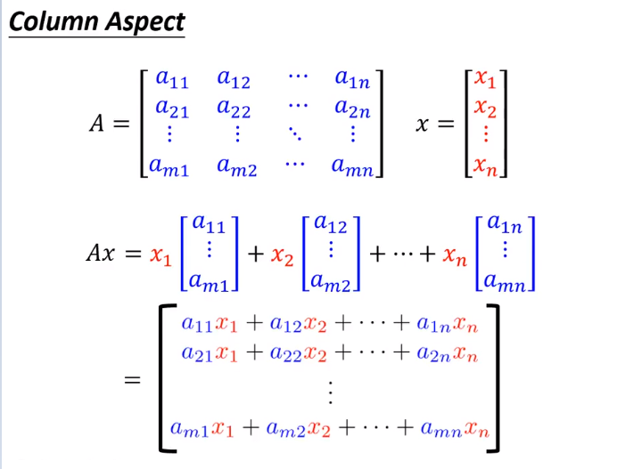

另外一个理解的方式是从column的角度来理解，可能多数人习惯从row的角度来理解，但是有些问题从column的角度来理解比较容易。  

将A的每一个column看做是一个vector，总共有n个vector。column的看法是：将第一个vector乘以$x_1$这个scalar，将第二个component$x_2$乘以A的第二个vector，一直到最后一个向量乘以$x_n$。每一个column乘以scalar做了变化以后，将这些变化后的column相加起来，就是matrix跟vector相乘。

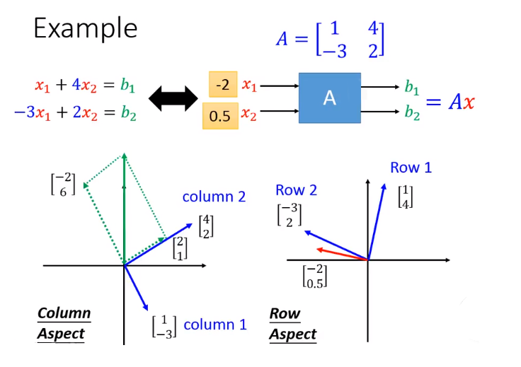

举一个例子来说明row aspect跟column aspect。如图联立的方程式看做是系统，系统的参数可以看做是$A=\begin{bmatrix}
1 &4 \\ 
-3 &2 
\end{bmatrix}$，系统的输入是$x_1,x_2$，输出是$b_1,b_2$，$b_1,b_2$等于Ax。如果将$x_1,x_2$拼起来变为二维vector，将这个二维vector作为linear system输入的时候，它的output就是这个vector跟A相乘。

从row的观点和column的观点来看会有什么样的不同呢？假设输入(-2, 0.5)，如果从row的观点来观察：将$\begin{bmatrix}
1\\ 
4
\end{bmatrix}，\begin{bmatrix}
-3\\ 
2
\end{bmatrix}$描绘出来，现在有一个vector是$\begin{bmatrix}
-2\\ 
0.5
\end{bmatrix}$，得到第一个output$b_1$是：红色的箭头跟row1的inner product，第一个output等于0。第二个output$b_2$是：红色的箭头跟row2的inner product，第二个output等于7。

从column的观点来看，系统有两个column$\begin{bmatrix}
1\\ 
-3
\end{bmatrix},\begin{bmatrix}
4\\ 
2
\end{bmatrix}$，当输入是$\begin{bmatrix}
-2\\ 
0.5
\end{bmatrix}$时，将-2乘以第一个column做变化变为绿色虚线的箭头($\begin{bmatrix}
-2\\ 
6
\end{bmatrix}$)，然后将0.5乘以第二个column做变化变为$\begin{bmatrix}
2\\ 
1
\end{bmatrix}$。从column的角度来看，当input$\begin{bmatrix}
-2\\ 
0.5
\end{bmatrix}$时，就是将两个column各自做伸缩，然后相加。

row aspect跟column aspect的结果是一样的，这就是“横看成岭侧成峰”的概念，它们的观点是不一样的，但是得到的结果是一样的。

matrix-vector相乘的size是要match的。图中的A跟x是不能进行相乘，从row的观点来观察，dimension不一样就不做inner product，从column观点来看也是不能相乘。从column的观点进行观察：将matrix A中的三个vector做combination然后相加，需要三个数值才能将三个column做combine，二个数值是行不通的。

column的数目必须跟vector dimension的数目相同才行，A'跟x才能做inner product

## 矩阵和向量相乘的性质

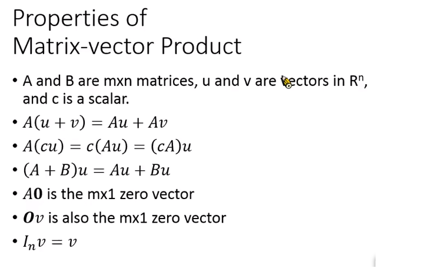

这张投影片是一些Matrix跟vector做inner product的一些性质。

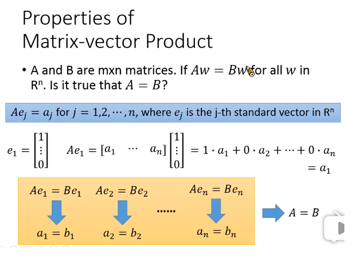

假设A跟B都是m by n的matrix，对于任何一个vector w和A, B相乘，$Aw$等于$Bw$。那么A和B相等吗？(答案是相等/成立的)

如果A乘以standard vector($e_j$)得到的结果为$a_j$，$e_1$的第一个dimension是1其它dimension为0。matrix A乘以$e_1$，(matrix A有n个columns，每一个column可以想象为一个vector）。

从column的角度来观察：将所有的column做combine，得到的结果为$a_1$，其它dimension也可以此类推。matrix A乘以$e_j$(第j维为1的vector)得到的结果是matrix第j个column。

$Aw$等于$Bw$，将w换为$e_1$，得到$Ae_1=Be_1$。$Ae_1$等于$a_1$(A的第一个column)，$Be_1$等于$b_1$(B的第一个column)，这就意味着A跟B的第一个column是相同的。$Ae_2$等于$a_2$(A的第二个column)，$Be_2$等于$b_2$(B的第二个column)，这就意味着A跟B的第二个column是相同的，一直到$Ae_n=Be_n$。所以A=B

这件事有趣的地方是：两个matrix(linear system)是不是相同，不需要将所有的输入都代入观察输出。其实只要代入n个standard vector，它们的输出是相同的，那么这两个系统就是相同的。

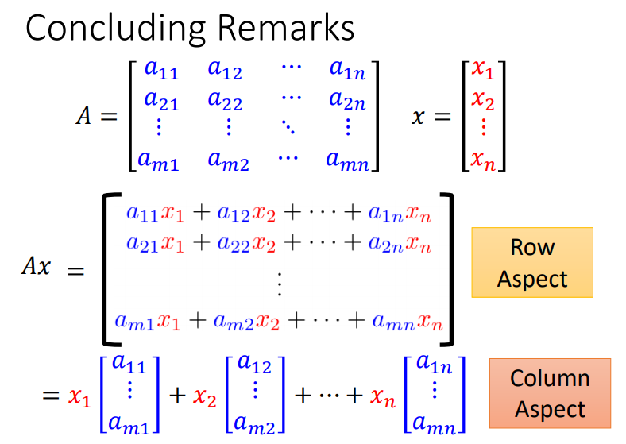

