## 有多少解
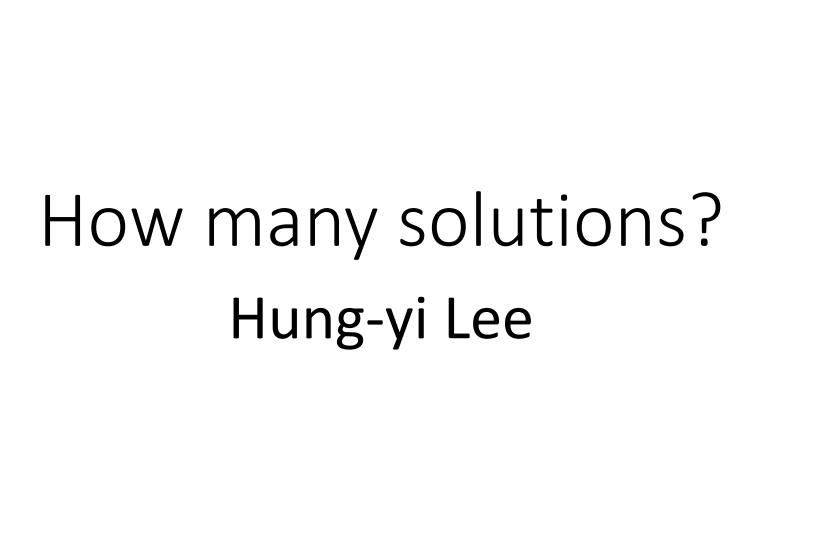

在上一节课我们讲的是检查一个linear ，接下来这堂课要讲是有解的情况下是有多少个解呢？

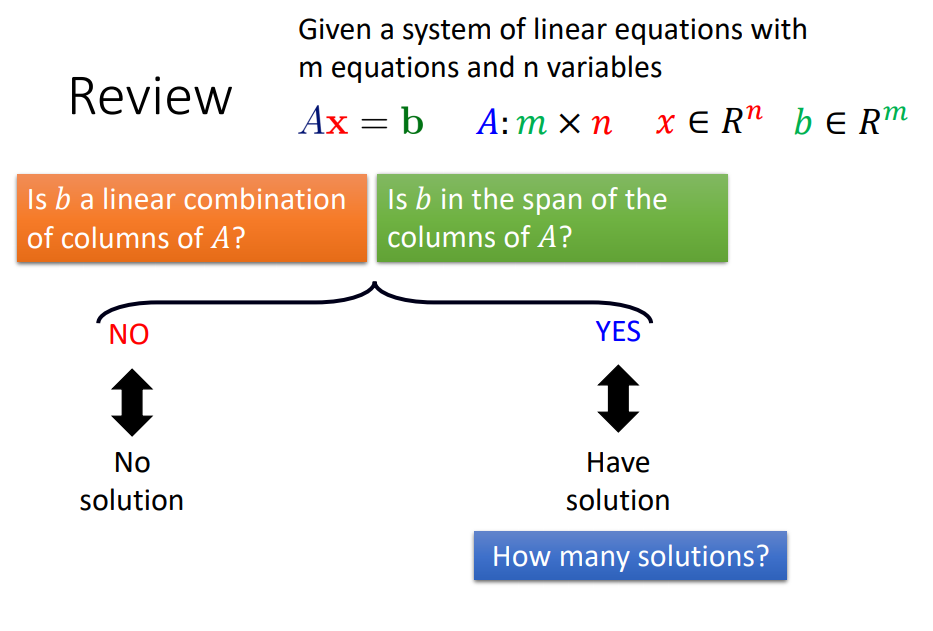

上节课讲了可以使用linear combination和Span的概念检查linear equation有没有解，这堂课要学习的内容是有解的前提下有多少个解呢？

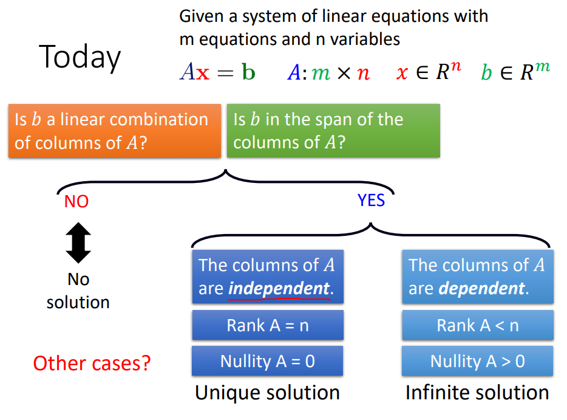

假设A的column是independent，或者假设Rank A=n，或者说Nullity A=0，那么A就有唯一解；另外的case是：A的column是dependent，或者Rank A<n，或者Nullity A>0，那么A就有无穷多解。

你可能会很疑惑为什么只考虑唯一解和无穷多解的case，怎么不考虑其它的解(比如有两个解，三个解)。一个linear equation有解的时候，它唯一的可能是一个解或者无穷多个解

## Dependent和Independent

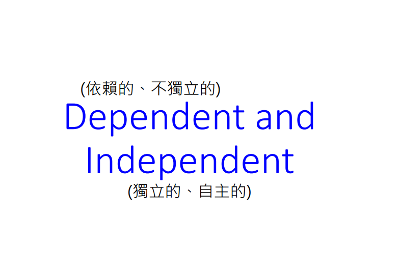

接下来介绍两个专有名词dependent(依赖的，不独立的)和independent(独立的，自主的)

### 定义

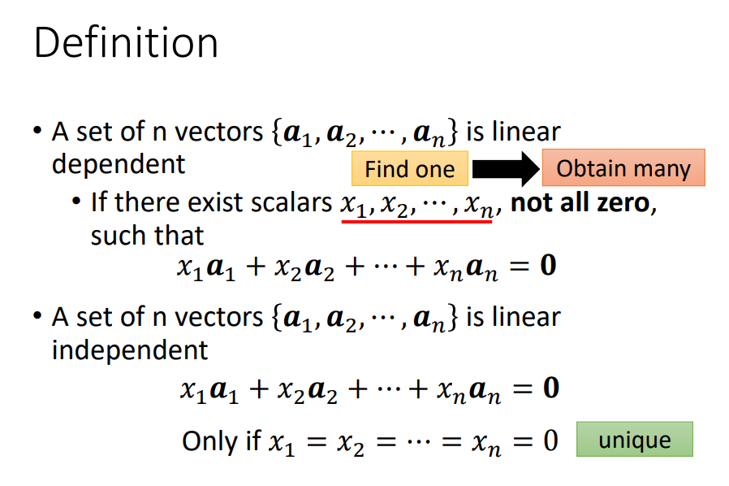

如果有一个vector set($a_1,a_2,a_n$)是linear dependent就要满足下列的条件，如果能找到一组scalar不能全是0($x_1,x_2,...x_n$)，然后将scalar和vector进行linear combination，然后得到的结果是zero vector，那我们就说这组vector是dependent。如果想要scalar和vector进行linear combination得到的结果为0，唯一的可能是coefficient都为0，那我们就说这组vector是independent。

如果可以找到一组scalar可以让linear combination等于0，就可以找到无穷多组

### 线性无关

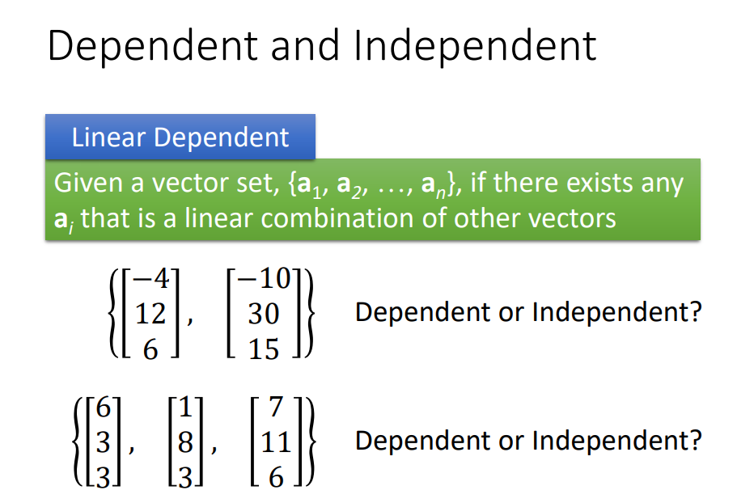

假设有一组vector set，在这个vector set中存在某一个vector($a_i$)是其它vectors的linear combination，那我们就说这个vector set是dependent。 现在有一个vector set($\begin{bmatrix}
-4\\ 
12\\ 
6
\end{bmatrix}, \begin{bmatrix}
-10\\ 
30\\ 
15
\end{bmatrix}$)，若将vector set里面的第二个vector乘以$\frac{2}{5}$就可以得到第一个vector，所以第一个vector是第二个vector的linear combination。所以这是一个dependent vector set。

假设现在有一组vector set($\begin{bmatrix}
6\\ 
3\\ 
3
\end{bmatrix},\begin{bmatrix}
1\\ 
8\\ 
3
\end{bmatrix},\begin{bmatrix}
7\\ 
11\\ 
6
\end{bmatrix}$)，第三个vector等于第一个vector加上第二个vector，所以第三个vector是前面两个vector的linear combination，所以这是一个dependent。

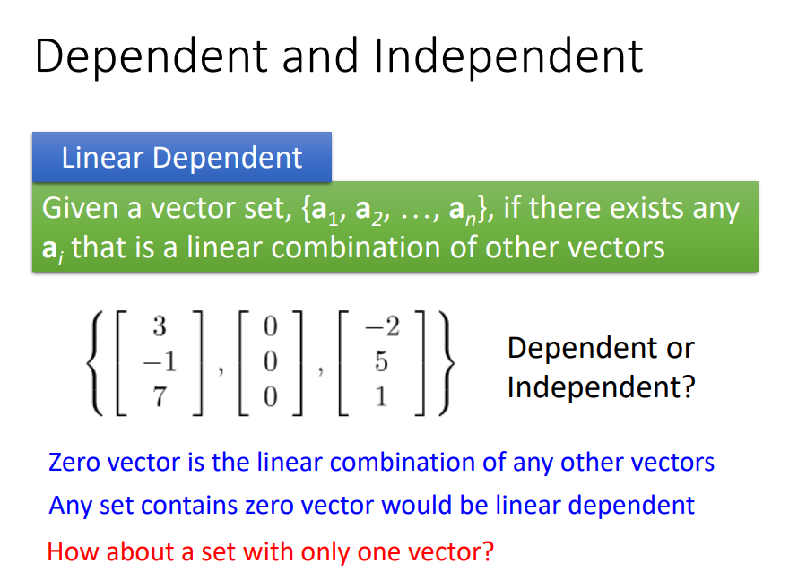

假设现在有一个vector set($\begin{bmatrix}
3\\ 
-1\\ 
7
\end{bmatrix}, \begin{bmatrix}
0\\ 
0\\ 
0
\end{bmatrix},\begin{bmatrix}
-2\\ 
5\\ 
1
\end{bmatrix} $)，第二个向量等于第一个向量和第三个向量乘以0，所以第二个向量是其它向量的linear combination，所以这个vector set是dependent

这个示例告诉我们，如果在一个vector set里面有zero vector，那这个vector ser就是dependent

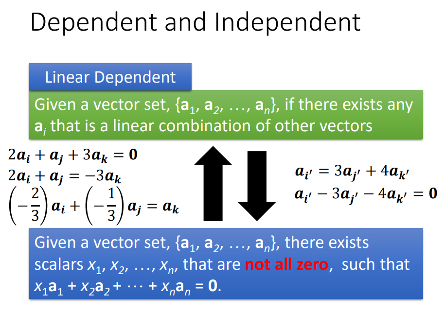

如图的两个描述都是在讲一件事情，假设有一个vector set是dependent，根据dependent的定义就是找一组不全为0的系数做linear combination得到zero vector。将$2a_i+a_j+3a_k=0$，将$-3a_k$移到等号的右边得到$2a_i+a_j=-3a_k$，等号的两边同时除以-3得到$-\frac{2}{3}a_i+(-\frac{1}{3}a_j)=a_k$，换句话就是：$a_k$是$a_i$和$a_j$的linear combination。所以这个vector set是dependent

反过来说也是一样的，dependent的意思是$a_i'=3a_j'+4a_k'$(其中某一个vector是其他vector的linear combination)，这句话的描述等同于将所有的数字移到等式的一边等于0。

所以上述两句话的描述是讲同一件事情。

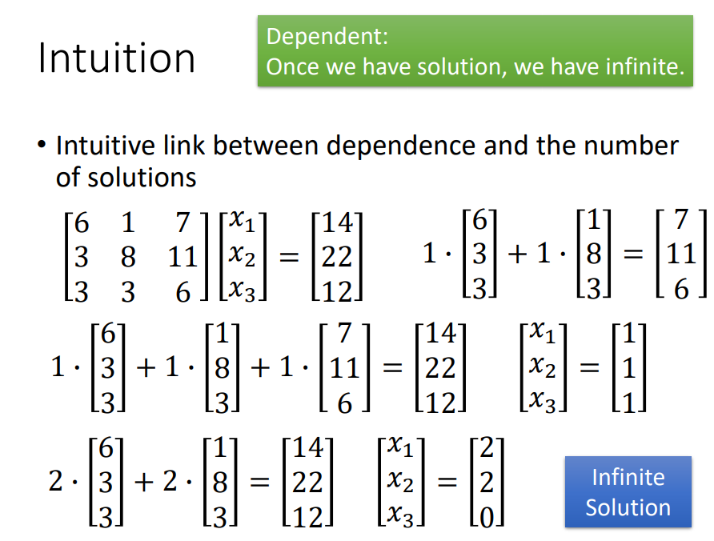

假设有一个linear equation，coefficient matrix的column是dependent，若这个system linear equation有解，就是无穷多解。但不保证因为matrix的column是dependent，就是有解，dependent跟有没有解这件事情是没有关系的。

假设现在有system linear equation为$\begin{bmatrix}
6 &1  &7 \\ 
 3&8  &11 \\ 
3 &3  &6 
\end{bmatrix}\begin{bmatrix}
x_1\\ 
x_2\\ 
x_3
\end{bmatrix}=\begin{bmatrix}
14\\ 
22\\ 
12
\end{bmatrix}$，其中coefficient matrix为$\begin{bmatrix}
6 &1  &7 \\ 
3 & 8 &11 \\ 
3 & 3 &6 
\end{bmatrix}$，这个vector set中第三个vector 等于第一个vector和第二个vector相加，所以这个vector set是dependent，若这个linear equation一旦有解，就是有无穷多解。

为什么一旦有解，就是有无穷多解呢？先假设我们找得到一组解为$x_1=1,x_2=1,x_3=1$`(`$\begin{bmatrix}
x_1\\ 
x_2\\ 
x_3
\end{bmatrix}$)，按照dependent的性质：多找到一组解，就是找到无穷多解。dependent的性质：其中的一个vector是其它vector的linear combination，我们可以用linear combination表示的vector换掉($1*\begin{bmatrix}
6\\ 
3\\ 
3
\end{bmatrix}+1*\begin{bmatrix}
1\\ 
8\\ 
3
\end{bmatrix}=\begin{bmatrix}
7\\ 
11\\ 
6
\end{bmatrix}$，$2*\begin{bmatrix}
6\\ 
3\\ 
3
\end{bmatrix}+2*\begin{bmatrix}
1\\ 
8\\ 
3
\end{bmatrix}=\begin{bmatrix}
14\\ 
22\\ 
12
\end{bmatrix}$)，就等于找到另外一组解为$x_1=2, x_2=2, x_3=0$($\begin{bmatrix}
x_1\\ 
x_2\\ 
x_3
\end{bmatrix}=
\begin{bmatrix}
2\\ 
2\\ 
0
\end{bmatrix}$)，那么就会有无穷多解。

## 证明

### 有解时会有无穷多解
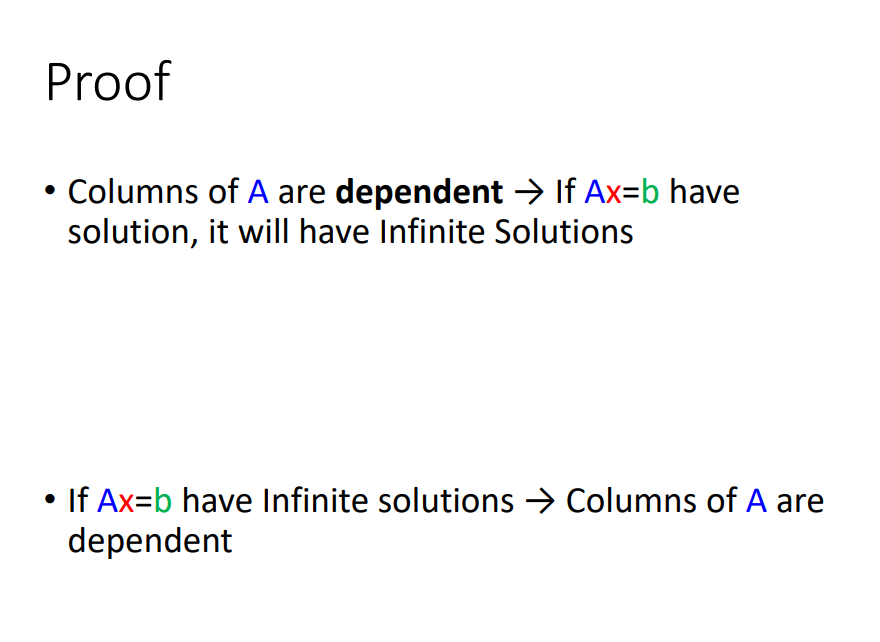

接下来是要证明的是：column是dependent在有解时就会有无穷多解，若我们想要证明这两件事情是等价的。那我们证明的时候就要分为分为两个方向：A的columns是dependent，一旦有解就是有无穷多解(dependent——无穷多解；若linear equation一旦有解，那这个linear equation 的column就是dependent。

### homogeneous

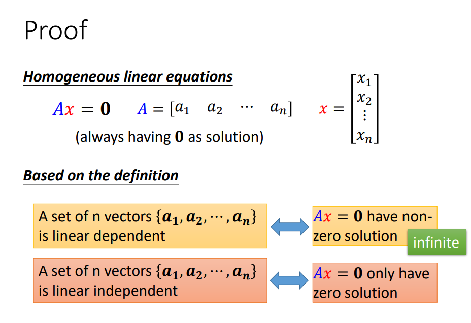

若有一个system linear equation的constant term等于0(b=0)，那我们就这个linear equation是homogeneous，homogeneous linear equation一定有解(一定有一组解为zero vector)

根据dependent和independent的定义我们马上可以得到以下的结论：若有一个vector set($a_1,a_2,a_n$)是dependent，用这组vector set来组成matrix A来产生一个homogeneous linear equation一定会有无穷多解。

假设有一组vector set($a_1,a_2,...a_n$)是independent，若要找一组参数$x_1,x_2,...x_n$乘以$a_1,a_2,...a_n$等于0，唯一的可能是：$x_1,x_2,...x_n$都为0(s定义)

### dependent——无穷多解

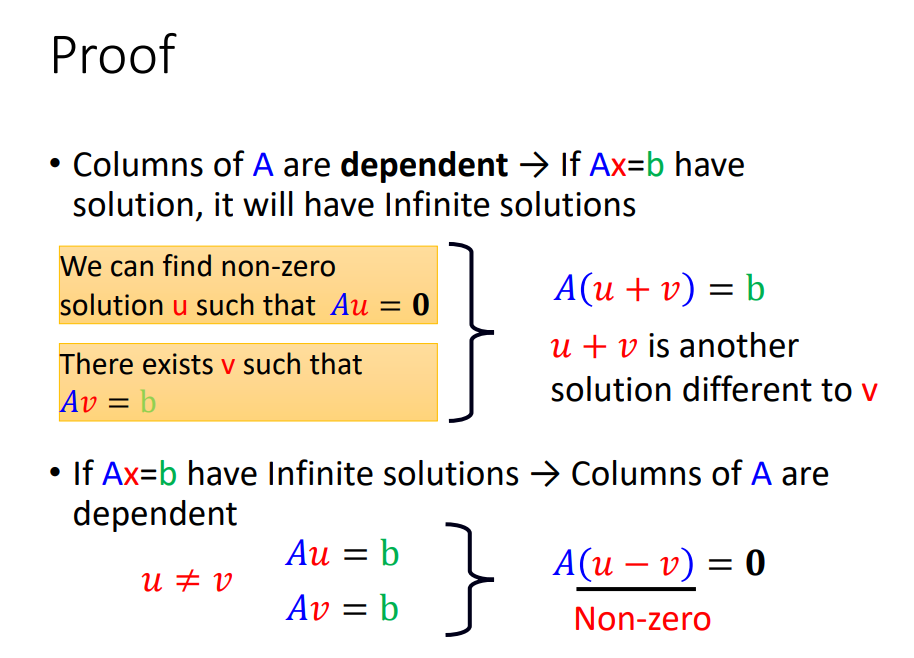

刚才只讲了homogeneous linear equation，现在要讲的是generous的情况。若matrix A一旦为dependent时，如果$Ax=b$有解，就一定会有无穷多解。

我们已经知道matrix A是dependent，根据dependent的定义：若homogeneous linear equation(Au=0)，其中u可以为non-zero vector。我们又知道$Ax=b$有解，现在存在v，使得$Av=b$。

现在已经得到$Au=0, Av=b$，接下来可将两个式子左右进行相加得到$A(u+v)=b$，非零的u和原来已经存在解v相加后得到新的solution，那我们就会得到无穷多的解(dependent——无穷多解)。

若现在有无穷多的solution，那就一定能够找到两个不相同的solution(u, v)，那么就会有$Au=b, Av=b$。接下来将这个式子进行相减得到$A(u-v)=0$，因为u不等于v，所以u-v不等于zero vector。这就是dependent的定义(能够找得到不全为零的coefficient跟matrix A的column进行linear combination后等于zero vector)

## Rank与Nullity

接下来要讲的内容是Rank与Nullity

### 计算Rank与Nulity的数目
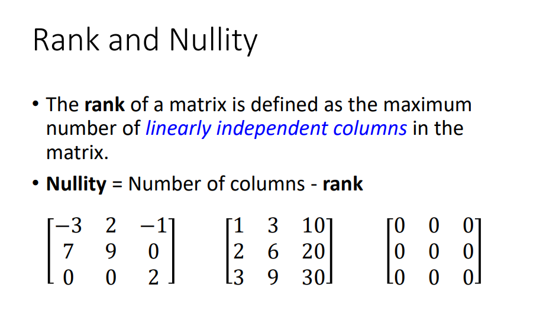

在matrix的column里可以找到最多independent columns的数目就叫做matrix的rank，剩下的column数目就是Nullify(Number of columns - rank)

### 示例

假设有matrix$\begin{bmatrix}
-3 &2  &-1 \\ 
 7& 9 &0 \\ 
0 & 0 & 2
\end{bmatrix}$，那个这个matrix的rank是多少呢？这个问题等同于从这个matrix set里面可以找到多少个vector放在一起是independent。经过观察这个matrix是independent的，rank等于3，nullity等于0

假设有matrix$\begin{bmatrix}
1 &3  &10 \\ 
 2& 6 &20 \\ 
3 & 9 & 30
\end{bmatrix}$，经过观察这个matrix的rank等于1，nullity等于2(多个vector时，按照某一个vector是其它vector的linear combination。只有一个vector时，按照dependent和independent定义)。 

假设有matrix$\begin{bmatrix}
0 &0  &0 \\ 
 0& 0&0 \\ 
0 & 0 & 0
\end{bmatrix}$，经过观察这个matrix的rank等于0，nullity等于3

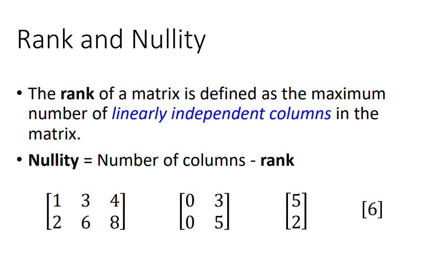

假设有matrix$\begin{bmatrix}
1 &3  &4 \\ 
2 & 6 & 8
\end{bmatrix}$，经过观察这个matrix的rank等于1，nullity等于2。

假设有matrix$ \begin{bmatrix}
0 &3 \\ 
 0&5 
\end{bmatrix}$，若rank=2时，因为这个matrix set里面有zero vector，所以是dependent。经过观察这个matrix的rank=1，nullity等于1($\begin{bmatrix}
3\\ 
5
\end{bmatrix}$)。

假设有matrix$\begin{bmatrix}
5\\ 
2
\end{bmatrix}$，经过观察这个matrix的rank等于1，nullity等于0。

假设matrix里面只有一个element$[6]$，经过观察这个matrix的rank等于1，nullity等于0。

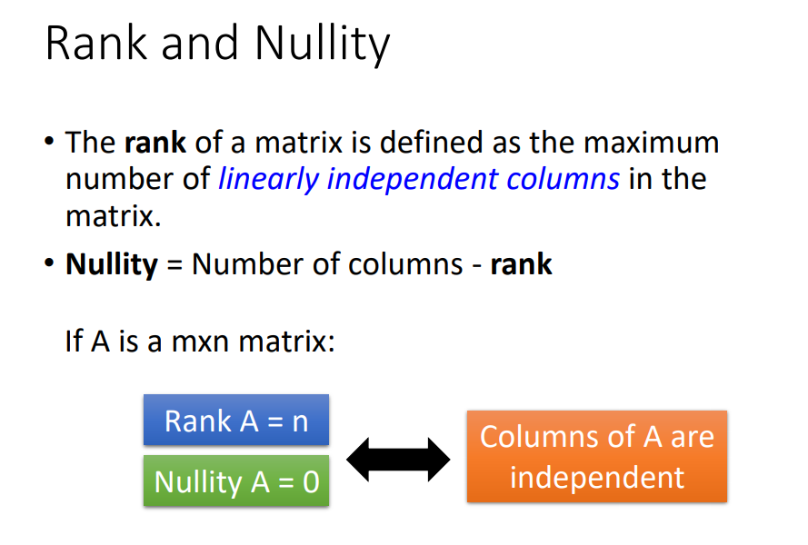

假设matrix A是m by n的matrix(m个row，n个column)，若它的rank是n(nullity为0)代表它的columns都为independent，若columns都为independent代表为只会有唯一解

## 判断唯一解还是无穷多解

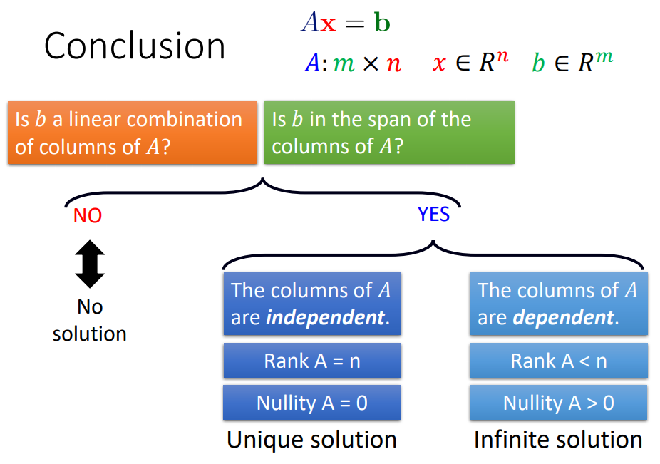

我们这堂课学到的内容是：一个linear equation有解以后，进一步根据independent，根据rnk，根据nullity判断是唯一解还是无穷多解。

## 流程图的另一种画法

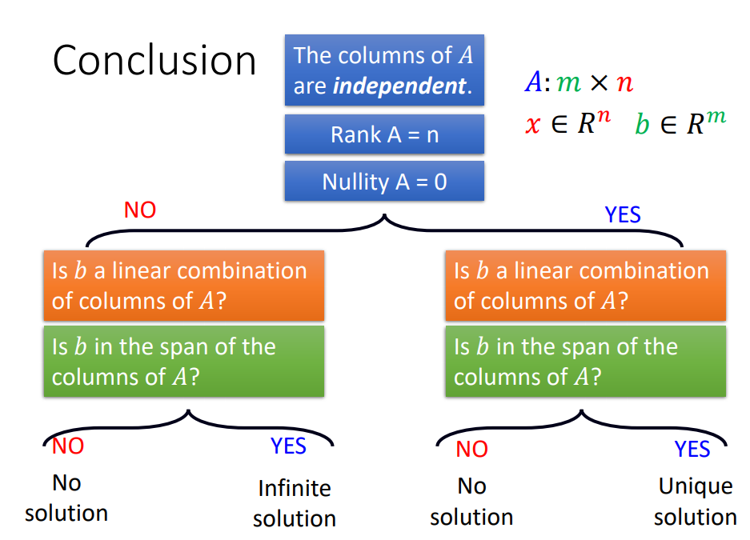

上述的流程图还可以这样来画，给定一个linear equation的coefficient 是matrix A，先判断是否为independent，或者检查rank等于n，或者检查nullity等于0。检查完以后不能够说：若matrix A为dependent就是有无穷多解，matrix A为independent为independent就是有唯一解。因为dependent还是independent跟有没有解是没有关系的，是有解的情况下判断是有唯一解还是无穷多解。

所以就算是知道column为dependent还是independent，你仍然不知道它到底有多少解。你还要进一步去确认到底是否有解，如果是在independent的情况下发现是没有解，那就是没有解；发现是有解的，那就是有唯一解。若不是在independent(dependent)的情况下，不满足如图的两个条件就是没有解，一旦有解就时有无穷多解。

